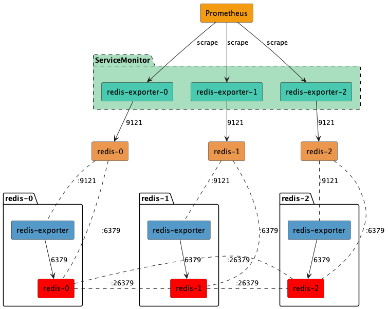

## 玉山銀行 redis-sentinel-cluster

### 架構圖



### Values 設定

1. 所有 `values.yaml` 的設定如下: 

```
redisSerialNumber: 1
ocpProjectName: 
containerPlatform:
logVolumnCapacityGB: 1
redisBaseImage: 
redisExporterImage:
resourceLimitCPU: 1
resourceLimitMemory: 2048
resourceRequestCPU: 0.2
resourceRequestMemory: 512
mailTo: esun-to-mail@example.com
mailFrom: esun-from-mail@example.com
smarthost: smtp-host:465
authUsername: smtp-username
```

2. 可以透過以下指定設定: 

```
helm install redis-sentinel --set ocpProjectName=<project-name>,containerPlatform=<platform>,redisBaseImage=<redis-image>,redisExporterImage=<exporter-image> <helm-folder> -n <namespace> --kubeconfig=<kubeconfig-path>
```

for example:

```
helm install esun-bank-all-template harbor-1/esun-bank-all-template --version="v0.0.4" --set ocpProjectName="redis",containerPlatform="ocp",redisBaseImage="redis:7.0",redisExporterImage="oliver006/redis_exporter:v1.50.0" --namespace=redis --create-namespace
```

### 部署資源

kind | name | description
-----|-------|-------
ClusterRole | redis-monitor | 
ClusterRoleBinding | prometheus-redis-monitor |
AlertmanagerConfig | redis-config |
Secret | mail-secret |
ServiceMonitor | redis-exporter-0 |
ServiceMonitor | redis-exporter-1 |
ServiceMonitor | redis-exporter-2 |
NetworkPolicy | allow-redis |
PersistentVolume  | ?-redis-v0-logging | 
PersistentVolumeClaim | ?-redis-v0-logging | 
PrometheusRule | redis-exporter-rules | 
Service | redis-0 |
Service | redis-1 |
Service | redis-2 |
StatefulSet | redis-0 |
StatefulSet | redis-1 |
StatefulSet | redis-2 |